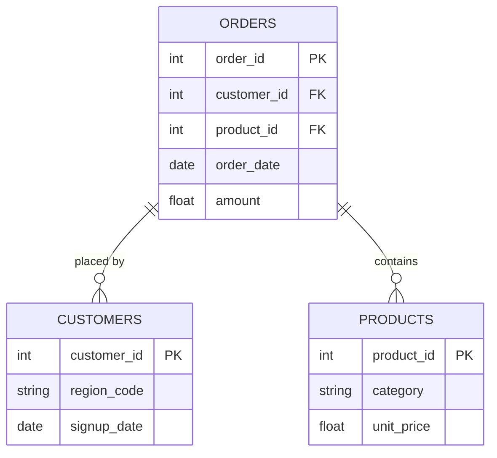

# [Project Title]
> *One sentence. What did you analyze, build, or solve - and why does it matter?*

---

## ⚙️ Project Type Flags
> *Check what applies. This helps reviewers and collaborators understand the nature of the work at a glance. Delete this block before publishing.*

- [x] Exploratory Data Analysis (EDA)
- [x] SQL Analysis / Querying

---

## Table of Contents
1. [Project Overview](#1-project-overview)
2. [Objectives](#2-objectives)
3. [Project Scope & Tools](#3-project-scope--tools)
4. [Data Workflow](#5-data-workflow)
5. [Data Model & Schema](#6-data-model--schema)
6. [ERD - Entity Relationship Diagram](#7-erd--entity-relationship-diagram) *(SQL projects)*
7. [Analysis & Metrics](#8-analysis--metrics)
8. [Recommendations](#10-recommendations)
9. [Assumptions & Limitations](#11-assumptions--limitations)
10. [Author](#14-author)

---

## 1. Project Overview

**Context:**
This project was created to practice cleaning and preparing a real-world layoffs dataset for analysis. The raw dataset contained inconsistencies such as duplicate records, inconsistent naming, missing values, incorrect formatting, and unnecessary records. Before using the data for exploratory analysis, I needed to make sure it was as consistent and reliable as possible.

**Approach**
I imported the raw layoffs dataset into MySQL and created a separate staging table so the original data remained untouched. I then worked through the data systematically by removing duplicates, standardizing inconsistent values, handling missing information, converting data types, and removing records and columns that were not useful for the planned analysis.
Outcome:

**Problem Statement:**
How can I transform a messy global layoffs dataset into a clean, structured dataset that can be confidently used for exploratory data analysis and visualization?

**Outcome:** 
I produced a cleaned and analysis-ready layoffs dataset. The project also gave me practical experience with SQL techniques such as ROW_NUMBER(), CTEs, JOINs, UPDATE, DELETE, TRIM(), STR_TO_DATE(), and ALTER TABLE, while following a workflow that reflects how data cleaning can be handled in a real analytics environment.

---

## 2. **Objectives**

**Primary Objective**
Clean and standardize the global layoffs dataset so it can be reliably used for exploratory data analysis.

**Secondary Objective 1**
Identify and remove duplicate records without modifying the original raw dataset.

**Secondary Objective 2**
Standardize inconsistent values, missing fields, text formatting, and date formats to improve data quality.

**Secondary Objective 3**
Remove unusable records and temporary fields that could negatively affect future analysis.
Every analysis decision in this project traces back to one of these objectives.

---

## 3. **Project Scope & Tools**

### Scope

| Dimension | Details |
|-----------|---------|
| **In Scope** | Global layoffs dataset containing company, location, industry, layoffs, percentage laid off, date, stage, country, and funds raised |
| **Out of Scope** | External datasets not included in the original source |
| **Time Period** | Layoff records covering approximately 2020–2023 based on the source dataset |
| **Granularity** | Individual layoff record / row-level data |

### Tools & Technologies

| Category | Tool(s) Used |
|----------|-------------|
| Data Storage | MySql |
| Data Processing |MySQL |
| Analysis | SQL queries |
| Version Control | GitHub |
| Documentation | Markdown / Project documentation |
| Other |MySQL Workbench |

---

## 4. **Data Workflow**

1. **Source:**
   The project used a real-world global layoffs dataset provided as a CSV file. The dataset contained approximately 2,361 records before cleaning and included information about companies, locations, industries, layoffs, dates, company stages, countries, and funding.
   
2. **Ingestion:**
   The CSV file was imported into MySQL using the MySQL Workbench Table Data Import Wizard. The raw data was preserved in its original form, and a separate staging table was created for the cleaning process.
This was an intentional choice because modifying raw data directly is risky. Keeping a raw copy made it possible to recover the original data if a transformation caused an unexpected result.

3. **Cleaning:**
   Several data-quality issues were identified and addressed:
Duplicate records were identified using ROW_NUMBER() and PARTITION BY.
Extra whitespace was removed from company names using TRIM().
Inconsistent industry labels such as different variations of cryptocurrency-related categories were standardized to Crypto.
Incorrect country formatting, such as United States., was corrected.
Blank industry values were converted to NULL for consistency.
Where possible, missing industry values were populated by matching the same company and location to another record containing the industry.
Text-based dates were converted into proper date values using STR_TO_DATE().
Records with both total_laid_off and percentage_laid_off missing were removed because they provided very limited value for the planned analysis.
A temporary row_num field used for duplicate detection was removed after the cleaning process.

4. **Transformation:**
    The main transformations focused on making existing data more consistent rather than creating complex new metrics.
Key transformations included:
Creating staging tables for safe data manipulation.
Creating a temporary row_num field for duplicate identification.
Converting date text into a proper MySQL DATE data type.
Standardizing categorical values.
Filling selected missing industry values using a self-join.
Removing temporary columns after they were no longer required.

5. **Output:**
     The final output was a cleaned staging table containing standardized, analysis-ready layoffs data. This dataset is intended to serve as the foundation for the next stage of the project: exploratory data analysis and visualization.


---


## 5.Data Model & Schema


### Dataset / Table: `[name]`

| Field Name | Data Type | Description | Example Value |
|------------|-----------|-------------|---------------|
| `Company` | VARCHAR  / Text | Name of the company affected by layoffs | Airbnb |
| `Location` | VARCHAR  / Text | Location associated with the layoff | Ibadan |
| `Industry` | VARCHAR  / Text | Industry or business sector of the company | Travel |
| `total_laid_off` | INT  | Numbers of employee laid off | 300 |
| `percentage_laid_off` | Decimal  / Float | Percentage of the workforce laid off | 0.10 |
| `date` | Date |Date the layoff was recorded | 2023-01-15 |
| `stage` | VARCHAR  / Text | Funding or company stage | Series B |
| `country` |  VARCHAR  / Text | Country associated with the company | Brazil |
| `funds_raised_millions` | Decimal  / Float | Total funding raised by the company in millions | 500 |

**Approximate initial row count**: 2,361 records

**Date rang**e: Approximately 2020–2023

**Key relationship**: No relational joins were required because the project was based primarily on a single layoffs dataset. A self-join on company and location was used during cleaning to populate missing industry values.

---

## 6. ERD - Entity Relationship Diagram
### *(Primarily for SQL Projects - remove this section if not applicable)*

<!--
  An ERD shows how your tables connect to each other visually.
  It is the fastest way for a reviewer to understand the data structure
  of a SQL project without reading every query.

  HOW TO INCLUDE YOUR ERD:
  Option A - Image embed (most common):
    Export your ERD from dbdiagram.io, DBeaver, Lucidchart, or similar.
    Save to /visuals/erd.png and reference it below.

  Option B - dbdiagram.io code block (version-controllable):
    Paste your schema definition code directly in the fenced block below.
    Anyone can paste it into dbdiagram.io to regenerate the visual.

  Option C - Mermaid diagram (renders natively in GitHub):
    Use the mermaid code block syntax below.
    GitHub will render this as a diagram automatically.

  PICK ONE. Don't use all three. Delete the options you don't use.
-->

### Option A - Embedded Image

*[Brief caption: e.g., "Three-table schema - orders, customers, and products joined on shared IDs."]*

---

### Option B - dbdiagram.io Schema Definition
```
Table orders {
  order_id    int     [pk]
  customer_id int     [ref: > customers.customer_id]
  product_id  int     [ref: > products.product_id]
  order_date  date
  amount      float
}

Table customers {
  customer_id int  [pk]
  region_code string
  signup_date date
}

Table products {
  product_id   int    [pk]
  category     string
  unit_price   float
}
```
*Paste this into [dbdiagram.io](https://dbdiagram.io) to view the visual.*

---

### Option C - Mermaid Diagram *(renders on GitHub)*


---

**Table Relationships Summary:**

| Relationship | Join Key | Type |
|-------------|----------|------|
| `orders` → `customers` | `customer_id` | Many-to-One |
| `orders` → `products` | `product_id` | Many-to-One |
| [Add rows as needed] | | |

---

## 7. Analysis & Metrics

<!--
  Explain what you measured and how - before you share what you found.

  WHAT GOOD LOOKS LIKE:
  Metric: "Customer Return Rate"
  Definition: "Number of transactions flagged as returns divided by total
               transactions, calculated at product-category and regional grain."
  Why It Matters: "Return rate - not sales volume - was hypothesised to
                  explain regional revenue gaps. This metric tests that hypothesis."


            
  WHAT TO AVOID:
  ❌ Defining a metric only in code: SUM(returns) / COUNT(transaction_id)
     That's an implementation. Write the plain-language definition here.
     Both belong in your project - the definition in the README,
     the implementation in the code.
-->

### Analytical Approach

This phase was primarily exploratory data preparation rather than predictive analysis. The main objective was to understand the structure and quality of the dataset, identify data-quality problems, and resolve issues that could affect future analysis.

The process involved inspecting distinct values, checking for duplicates, identifying missing values, testing assumptions, and validating changes before applying updates or deletes.

A key principle throughout the project was:

Inspect → Test → Validate → Update

For example, instead of immediately deleting records, I first used SELECT queries to identify what would be affected and then converted the logic into DELETE or UPDATE statements after validating the results.

Metric
Plain-Language Definition
Why It Matter


### Key Metrics Defined

| Metric | Plain-Language Definition | Why It Matters |
|--------|--------------------------|----------------|
| Total Laid Off | Number of employees reported as laid off in a record | Core measure for understanding the scale of layoffs |
| Percentage Laid Off`| Percentage of the company’s workforce affected | Helps compare the relative impact across companies |
| Funds Raised (Millions) | Amount of funding a company had raised, expressed in millions | Can provide context for understanding companies experiencing layoffs |

### Methods Used

- **Data-quality profiling** — inspected distinct values, nulls, blanks, duplicates, and inconsistent categories.
- **Duplicate detection** — used ROW_NUMBER() with PARTITION BY.
- **Data standardization** — used TRIM(), pattern matching, and targeted UPDATE statements.
- **Missing-value analysis** — compared records within the same company and location to determine whether values could be safely populated.
- **Date transformation** — converted text dates into a proper SQL DATE format using STR_TO_DATE().
- **Data reduction** — removed records that lacked the key layoff measures required for the planned analysis

---

## 8. **Recommendations**
-->

| Priority | Recommendation | Based On | Suggested Owner |
|----------|---------------|----------|-----------------|
| High | [Specific, actionable step] | [Insight it comes from] | [Who should act] |
| Medium | [Specific, actionable step] | [Insight it comes from] | [Who should act] |
| Low | [Exploratory or longer-term suggestion] | [Insight it comes from] | [Who should act] |

---

## 9. Assumptions & Limitations


### Assumptions
- The source dataset was treated as a reasonable representation of reported layoffs during the period covered.

- Records with identical values across all relevant fields were treated as duplicates.

- Matching company + location was considered sufficient to identify the correct industry when another record contained a populated value.

- Standardized categories such as Crypto were treated as equivalent when the original labels clearly represented the same concept.

- Records missing both total_laid_off and percentage_laid_off were considered unsuitable for the planned layoff-focused analysis.
  
### Limitations

- The dataset contains missing values that could not be reliably recovered from the available information.

- Some companies may have incomplete or inconsistent reporting.

- The dataset does not provide enough information to accurately calculate missing layoffs or funding values without external sources.

- Removing records with missing layoff values improves analytical usability, but it may also remove legitimate observations and potentially introduce selection bias.

- The project focused on data cleaning, so no statistical testing, predictive modeling, or advanced business analysis was performed at this stage.

- The original dataset’s collection methodology and completeness were not independently verified.

- A more rigorous production workflow could include automated data-quality checks, validation rules, logging, version-controlled SQL scripts, and automated ETL pipelines.


**Portfolio Takeaway**

This project demonstrates more than basic SQL querying. It shows the ability to work with messy real-world data, protect raw data, create staging tables, identify and resolve data-quality issues, validate transformations, and prepare a dataset for downstream analysis.
The most important lesson from the project was that data cleaning is an iterative process. Not every missing value should be filled, not every unusual record should be deleted, and every transformation needs to be validated before it is applied. That decision-making process is just as important as knowing the SQL syntax.

## 10. Deliverables

| Deliverable | Description | Location |
|-------------|-------------|----------|
| [Name] | [What it contains] | [`/path/to/file`] |
| [Name] | [What it contains] | [`/path/to/file`] |
| [Name] | [What it contains] | [`/path/to/file`] |

---

## 14. Author

**[Your Name]**
[Your role or title - current or target]

- 🔗 [LinkedIn URL]
- 💼 [Portfolio or GitHub profile URL]
- 📧 [Email - optional]

---

*Last updated: [Month YYYY]*
*If this template helped you, consider starring the repository.*
